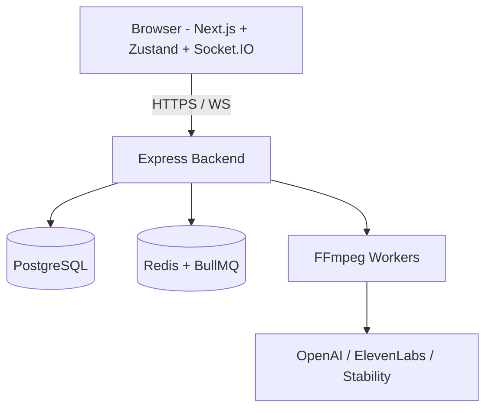
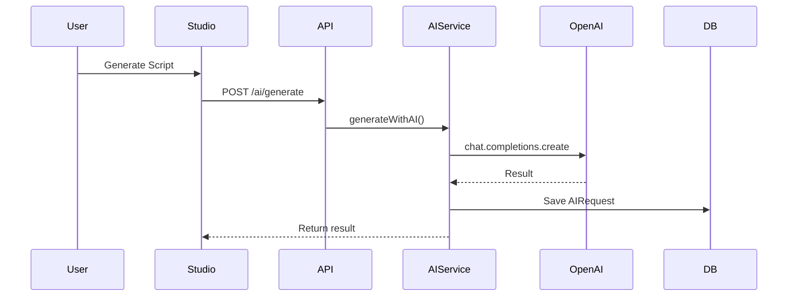
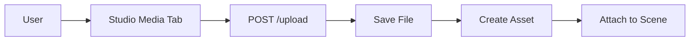

# DesignXpress AI Story Video Studio
## Complete User & Developer Guide

**Where Innovation Meets Excellence**

*Version 1.0 – Comprehensive Documentation*

---

**This document is an aggregated guide compiled from the project's full documentation set.**

For the most up-to-date individual documents, visit the [Documentation Hub](../docs/index.md).

---

## Table of Contents

1. [Project Overview](#project-overview)
2. [Getting Started (Windows 11)](#getting-started-windows-11)
3. [Architecture & System Design](#architecture--system-design)
4. [Development Guide](#development-guide)
5. [Frontend](#frontend)
6. [Backend](#backend)
7. [AI Integration](#ai-integration)
8. [FFmpeg Rendering System](#ffmpeg-rendering-system)
9. [Real-time Collaboration](#real-time-collaboration)
10. [Deployment](#deployment)
11. [Testing](#testing)
12. [Performance](#performance)
13. [Security](#security)
14. [Troubleshooting](#troubleshooting)
15. [Contributing](#contributing)
16. [Roadmap](#roadmap)
17. [API Reference](#api-reference)
18. [Environment Variables](#environment-variables)

---

## Project Overview

DesignXpress AI is a premium cinematic AI-powered video storytelling platform.

**Key Highlights (v1.0)**:
- Professional AI Video Studio with advanced timeline
- Real uploaded video clip support in rendering
- Multi-track FFmpeg with music beds and transitions
- BullMQ-powered export queue with live progress
- Real-time collaboration (cursors + scene sync + chat)
- Templates Marketplace
- PayPal integration (sandbox)
- Full Windows-first development experience

---

## Getting Started (Windows 11)

See the full guide: [docs/getting-started.md](getting-started.md)

**Quick Steps**:
1. Run as Administrator: `Set-ExecutionPolicy -ExecutionPolicy RemoteSigned -Scope CurrentUser`
2. `.\scripts\install.ps1`
3. `.\scripts\setup.ps1`
4. `.\scripts\start.ps1`

Demo login: `demo@designxpress.ai` / `demo123456`

---

## Architecture & System Design

**Core Components**:
- Next.js 15 Frontend
- Express + TypeScript Backend
- PostgreSQL + Prisma
- Redis + BullMQ
- Socket.IO for real-time
- FFmpeg for rendering

See full details and diagrams in [docs/architecture.md](architecture.md) and the dedicated [docs/diagrams.md](diagrams.md).

### Key Diagrams (Mermaid)

**System Overview**:

**AI Services Data Flow**:

**Media Upload Pipeline**:

**Export Queue + State Machine** (see full diagrams in docs/diagrams.md and architecture.md)

**Data Model ER Diagram** (see full version in docs/diagrams.md)

---

## Development Guide

See [docs/development.md](development.md)

Key commands are in the root README.

---

## Frontend

**Tech**: Next.js 15, TypeScript, Tailwind, Zustand, Framer Motion, Socket.IO Client

**Key Files**:
- `app/studio/page.tsx` – Main editor
- `lib/store.ts` – Global state
- `lib/api.ts` – API client

Full details: [docs/frontend.md](frontend.md)

---

## Backend

**Tech**: Express, Prisma, BullMQ, Socket.IO, JWT

**Important Services**:
- `services/exportQueue.ts` – BullMQ video export jobs
- `services/ffmpegService.ts` – Advanced rendering engine
- `services/aiService.ts` – AI integrations + fallbacks

Full details: [docs/backend.md](backend.md)

---

## AI Integration

- Script/Story/Scene generation via OpenAI (real when key present)
- Voiceovers via ElevenLabs
- Images via Stability AI
- Graceful demo fallbacks

Full details: [docs/ai-integration.md](ai-integration.md)

---

## FFmpeg Rendering System

One of the most powerful parts of the platform.

**Capabilities (v1.0)**:
- Real video clips per scene
- Multi-track audio with ducking
- Advanced transitions
- Burned titles & subtitles
- Runs via BullMQ workers

Full technical details: [docs/ffmpeg-rendering.md](ffmpeg-rendering.md)

---

## Real-time Collaboration

**Features**:
- Live cursors with names/colors
- Bidirectional scene synchronization
- In-Studio team chat
- Active user presence

Powered by Socket.IO rooms per project.

Full details: [docs/collaboration.md](collaboration.md)

---

## Deployment

**Recommended Path**: Railway (easiest)

Detailed, accurate steps available in [docs/deployment.md](deployment.md)

Also includes Docker production setup and AWS guidance.

---

## Testing

The project currently relies heavily on manual testing.

See recommended strategy, tools, and manual checklist in [docs/testing.md](testing.md)

---

## Performance

**Biggest Bottleneck**: FFmpeg rendering (CPU/I/O heavy)

Recommendations for optimization and scaling are in [docs/performance.md](performance.md)

---

## Security

- JWT authentication
- User-scoped data access
- File upload considerations
- Production hardening checklist

Full details: [docs/security.md](security.md)

---

## Troubleshooting

Common Windows, Docker, FFmpeg, database, and real-time issues + fixes.

See [docs/troubleshooting.md](troubleshooting.md)

---

## Contributing

See [docs/contributing.md](contributing.md)

We especially welcome contributions in:
- FFmpeg improvements
- Testing infrastructure
- Real-time collaboration features
- Documentation

---

## Roadmap

Current state and future plans are documented in [docs/roadmap.md](roadmap.md)

---

## API Reference

Key endpoints for Auth, Projects, Exports, AI, Templates, and Uploads.

See [docs/api-reference.md](api-reference.md)

---

## Environment Variables

Complete reference for all required and optional variables.

See [docs/environment-variables.md](environment-variables.md)

---

**End of Consolidated Guide**

This document was generated by aggregating the project's documentation suite for easy reference and PDF export.

For the best experience, use the individual topic-focused documents linked above.
