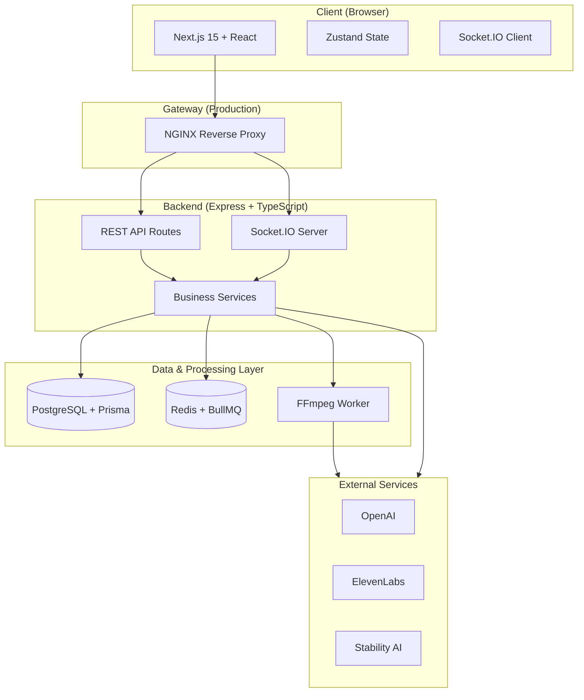
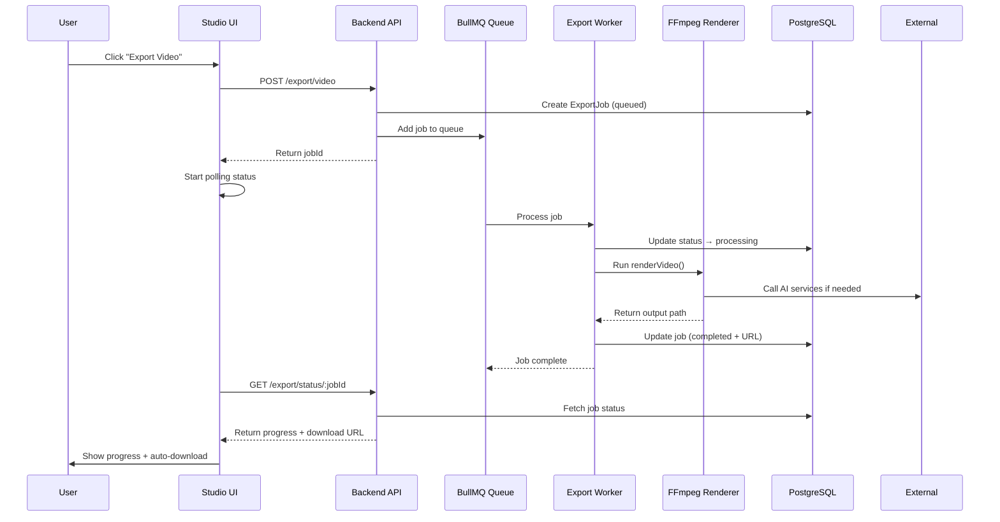
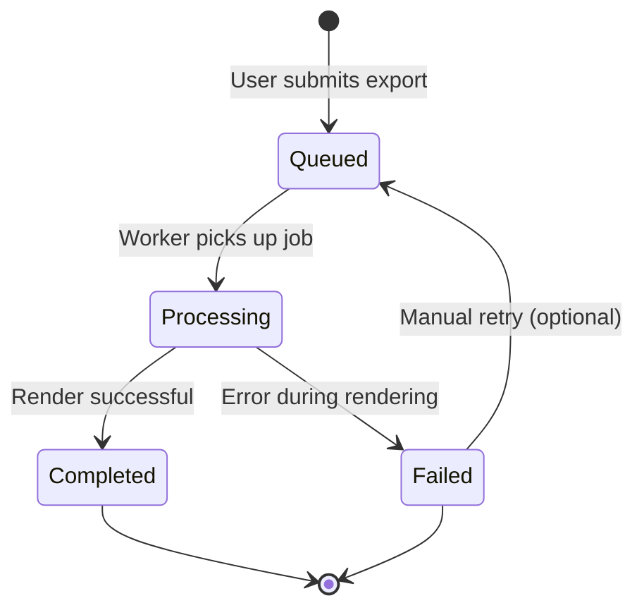
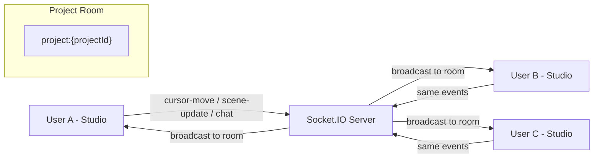
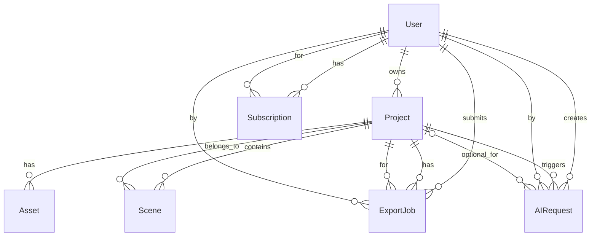

# Architecture Overview

This document describes the high-level system design of **DesignXpress AI Story Video Studio**.

## System Overview

DesignXpress is a full-stack application consisting of:

- **Frontend**: Modern single-page application built with Next.js
- **Backend**: REST API + WebSocket server
- **Data Layer**: PostgreSQL + Redis
- **Media Processing**: FFmpeg (via background jobs)
- **AI Services**: OpenAI, ElevenLabs, Stability AI
- **Job Queue**: BullMQ + Redis

## High-Level Architecture

### System Overview Diagram

### Video Export Flow (BullMQ)

### Export Job State Machine

### Real-time Collaboration Flow

## Data Model (Key Entities)

- **User** – Authentication and ownership
- **Project** – Main container for a video story
- **Scene** – Individual timeline segment (can contain video, image, audio, text)
- **Asset** – Uploaded media files
- **AIRequest** – History of AI generations
- **ExportJob** – Background video render jobs (BullMQ + DB)
- **Template** – Reusable published projects

### Entity Relationship Diagram

## Key Flows

### 1. Creating & Editing a Project
1. User creates project via Dashboard
2. Opens project in Studio
3. Adds/edits scenes (local Zustand state)
4. Changes are saved to PostgreSQL
5. If collaborators are present → changes broadcast via Socket.IO

### 2. Video Export Flow (v1.0)
1. User clicks "Export Video" in Studio
2. Frontend calls `POST /api/export/video`
3. Backend creates `ExportJob` record and adds job to BullMQ queue
4. Worker picks up job and runs `renderVideo()` (advanced FFmpeg pipeline)
5. Progress is updated in real time (polled by frontend)
6. On completion → output file is made available for download

### 3. Real-time Collaboration
- All users in the same project join a Socket.IO room (`project:{id}`)
- Cursor movements are broadcast to other users
- Scene changes are emitted and applied optimistically on other clients
- Simple chat messages are relayed in real time

## Technology Decisions

- **Next.js App Router** — Modern React patterns and server components
- **Zustand** — Lightweight global state (preferred over Redux for this scale)
- **Prisma** — Type-safe database access
- **BullMQ** — Reliable background jobs with retries and progress
- **Socket.IO** — Battle-tested real-time communication
- **FFmpeg** — Industry standard for video processing (scriptable and powerful)
- **Docker** — Consistent environment across development and production

## Security & Isolation

- JWT-based authentication on all protected routes
- User-scoped queries (projects, exports, etc.)
- File uploads stored in user/project-specific folders
- Environment variables for all secrets

---

This architecture balances rapid local development (Windows-first) with a clear path to scalable production deployment.
