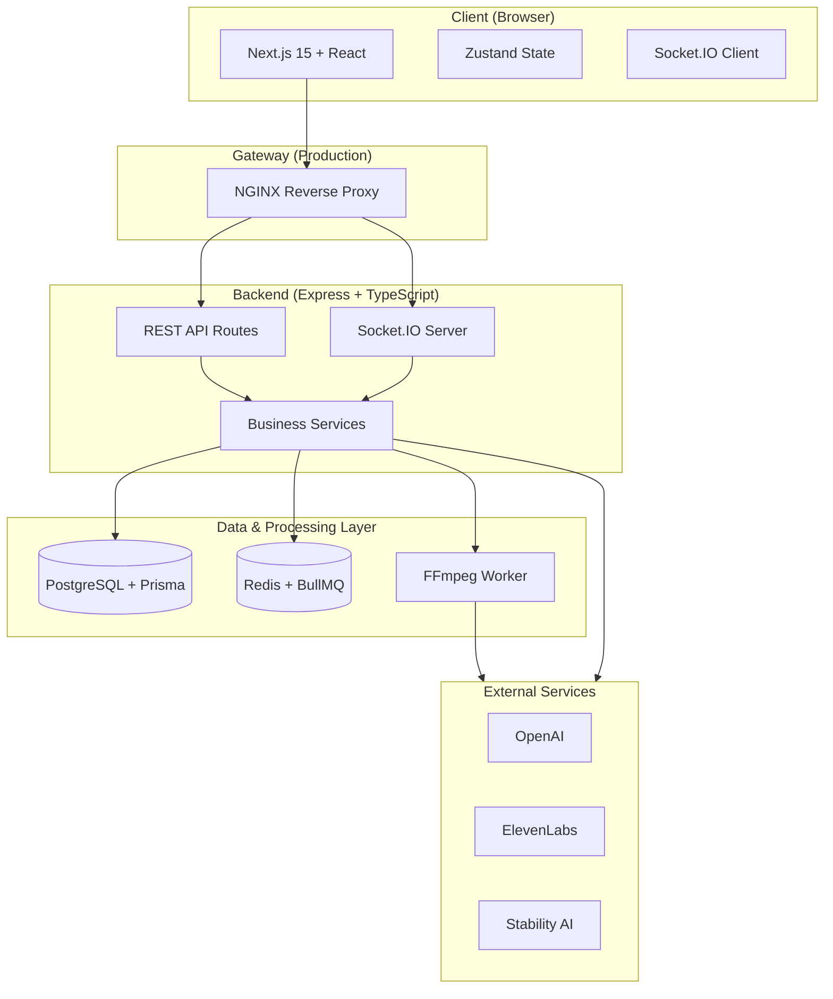
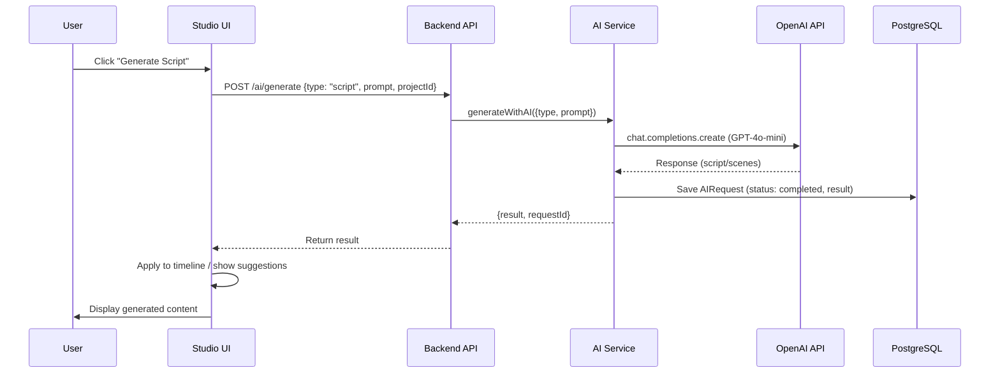
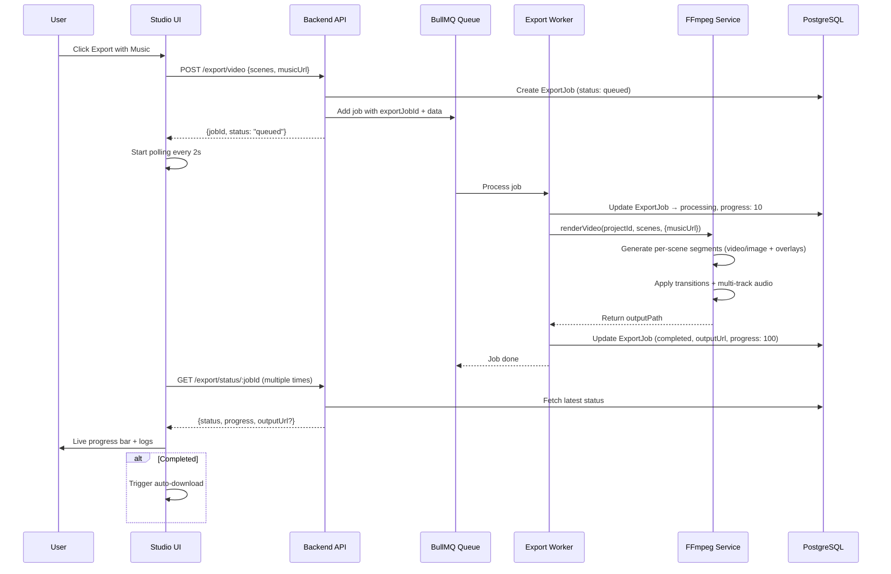
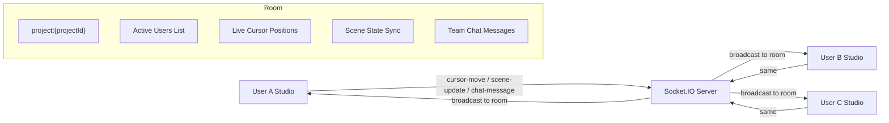
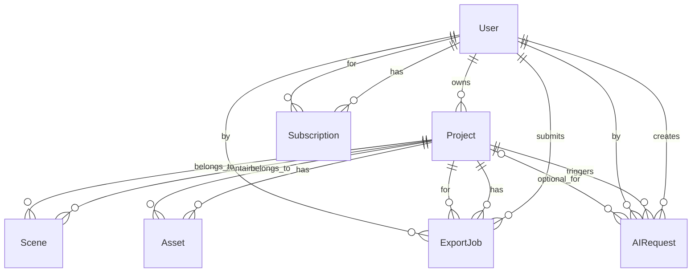

# DesignXpress AI - Diagrams and Visual Documentation

This document centralizes all visual diagrams for the DesignXpress AI Story Video Studio platform. Diagrams are written in Mermaid syntax for easy rendering in GitHub, VS Code, and documentation tools.

## 1. High-Level System Architecture



## 2. AI Services Data Flow



**Notes on AI Flow:**
- If OpenAI key is missing or rate-limited → graceful fallback to high-quality mock data in `aiService.ts`
- All AI calls are logged in the `AIRequest` table with status, tokens, and cost
- Error handling: Network failures, invalid prompts, and quota errors are caught and returned with clear messages

## 3. Media Upload Pipeline

```mermaid
flowchart LR
    User[User in Studio] --> Upload[Upload Component]
    Upload --> API[POST /upload]
    API --> Multer[File Parser]
    Multer --> Storage[Save to uploads/ folder]
    Storage --> DB[Create Asset record in DB]
    DB --> Response[Return {url, filename, type}]
    Response --> Studio[Update Zustand Store]
    Studio --> Scene[Attach to Selected Scene]
    Scene --> Timeline[Update Timeline UI]
    Scene --> Preview[Enable Video/Image Preview]
```

**Key Details:**
- Supports image, video, and audio files
- Files are stored locally in `uploads/` (production should use S3/Spaces)
- After upload, user can immediately attach the asset to any scene
- Video assets become playable in the Studio preview
- Video assets are passed to FFmpeg for real clip rendering

## 4. Export Queue + BullMQ Flow (Detailed)



**Error Handling in Queue:**
- Job failures are caught and stored in `ExportJob.error`
- Up to 2 automatic retries with exponential backoff
- User sees clear failure state in the progress modal

## 5. Real-time Collaboration Flow



## 6. Project + Scene Data Model (ER Diagram)



---

These diagrams are maintained in `docs/diagrams.md` and embedded in `docs/architecture.md` for easy reference.

For the best experience, view this file in a Markdown renderer that supports Mermaid (GitHub, VS Code with Mermaid extension, etc.).
